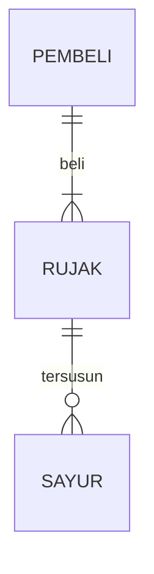

## 1.1 Latar Belakang

siapa yg tidak tertarik dgn makanan enak terjangkau dan juga murah. tentu saja makanan yg enak sangat mengunggah selera, makanan yg teramat enak juga menjadi buruan sebagian orang yang sangat mencintai makanan, di era digital ini banyak sekali orang yg menginginkan mengakses semua hal dengan mudah praktis dan simple, agar bisa memudahkan apa saja yg ingin mereka lakukan. karena itu saya membuat web pemesanan makanan agar semua orang bisa mengakses dan membeli makanan dgn mudah tanpa harus keluar rumah panas panasan dan antrian yg sangat panjang hanya cukup dgn bersantai di rumah dan membuka gadget nya untuk memesan makanan dengan mudah kapan pun dimanapun

## 1.2. Deksripsi Teknologi Informasi

Pada pembuatan aplikasi kali ini saya menggunakan beberapa teknologi informasi diantaranya :
1. menggunakan database Mysql untuk menyimpan dan mengelola data makana pembeli dan sebagai nya pada web saya ini
2. untuk frontend saya baru saja menggunakan html dan css
3. untuk backend saya belum memakai nya dan kedepan nya saya akan menggunakan backend
4. untuk desain saya menggunakan figma
5. untuk tools pembuatan web saya saya menggunakan visual studio code
6. dan untuk operasi OS saya menggunakan windows

## 1.3. Branding

bla bla bla

## 2. User Story

bla | bla | bla | bla
---|---|---|---
bla | bla | bla | ⭐⭐⭐⭐⭐

## 3. Struktur Data

Cara membuat aneka macam bentuk grafik menggunakan mermaid.js bisa lihat di [https://mermaid.js.org/syntax/entityRelationshipDiagram.html](https://mermaid.js.org/syntax/entityRelationshipDiagram.html) 

## 4. Arsitektur Sistem

Masih pake mermaid.js juga bisa lihat flowchart di [https://mermaid.js.org/syntax/flowchart.html](https://mermaid.js.org/syntax/flowchart.html)

## 5. Teknologi, Library, dan Framework

bla bla bla

## 6. Desain User Experience dan User Interface

Bisa load image 

## 7. Demonstrasi Video

Link youtube nya

## 8. Bagaimana mesin komputasi dan sistem operasi berperan dalam produk teknologi informasimu ?

Link youtube nya di detik jawaban ini

## 9. Bagaimana algoritma, struktur data, dan bahasa pemrograman berperan dalam produk teknologi informasimu ?

Link youtube nya di detik jawaban ini

## 10. Bagaimana metode pengembangan perangkat lunak / Software Development Life Cycle berperan dalam produk teknologi informasimu ?

Link youtube nya di detik jawaban ini

## 11. Bagaimana database / sistem basis data berperan dalam produk teknologi informasimu ?

Link youtube nya di detik jawaban ini
